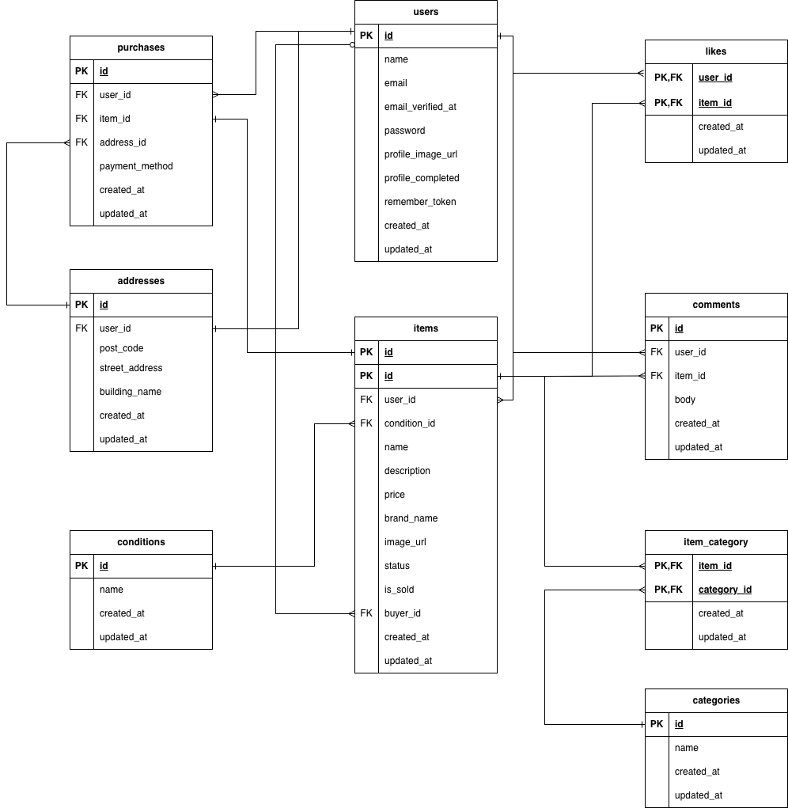

# flea-market-app(フリマサイト)

## 概要

ユーザーがアイテムの出品・購入ができるフリマアプリケーションです。

## 環境構築

### Docker ビルド

1. リポジトリをクローン

   ```bash
   git clone https://github.com/812eri/flea-market-app.git
   ```

2. DockerDesktop アプリを立ち上げる

3. コンテナをビルド・起動
   ```bash
   docker-compose up -d --build
   ```

※ MySQL は、OS によって起動しない場合があるのでそれぞれの PC に合わせて docker-compose.yml ファイルを編集してください。

※ Mac の M1・M2 チップ PC をご利用の場合、
no matching manifest for linux/arm64/v8 in the manifest list entries のメッセージが表示されビルドができないことがあります。
エラーが発生する場合は、docker-compose.yml ファイルの「mysql」内に「platform」の項目を追加で記載してください。

```YAML
mysql:
    platform: linux/x86_64 # ←ここに追加
    image: mysql:8.0.26
    environment:
```

### Laravel 環境構築

1. PHP コンテナに入る

   ```bash
   docker-compose exec php bash
   ```

2. 依存パッケージのインストール（Stripe ライブラリ等もここで入ります）

   ```bash
   composer install
   ```

3. 環境変数の設定 .env.example をコピーして .env を作成し、以下の設定を記述してください。

▼ データベース設定

```ini
DB_CONNECTION=mysql
DB_HOST=mysql
DB_PORT=3306
DB_DATABASE=laravel_db
DB_USERNAME=laravel_user
DB_PASSWORD=laravel_pass
```

▼ Stripe 決済設定（必須） Stripe ダッシュボードからキーを取得して設定してください。これがないと決済機能が動きません。

```ini
STRIPE_KEY=pk_test_xxxxxxxxxxxxxxxx
STRIPE_SECRET=sk_test_xxxxxxxxxxxxxxxx
```

4. アプリケーションキーの作成

   ```bash
   php artisan key:generate
   ```

5. マイグレーションの実行

   ```bash
   php artisan migrate
   ```

6. シーディングの実行
   ```bash
   php artisan db:seed
   ```

# 機能の確認方法

## 動作確認用アカウント

アプリの機能をすぐにご確認いただけるよう、テスト用アカウントを用意しています。

- **メールアドレス**: test@example.com
- **パスワード**: password

※商品データも投入済みですので、ログイン後すぐに詳細画面や決済機能などをお試しいただけます。

## メールの確認方法

本環境では実際にはメールは送信されず、MailHog というツールで擬似的にメールをキャッチします。
会員登録時の認証メールなどは、以下の URL にアクセスして確認してください。

- **メール確認画面**: http://localhost:8025

## 使用技術

- php 8.1
- Laravel 8.x
- MySQL 8.0
- Docker/Docker Compose
- Stripe API（決済機能）
- MailHog（メールサーバー等の仮想環境）

## ER 図


